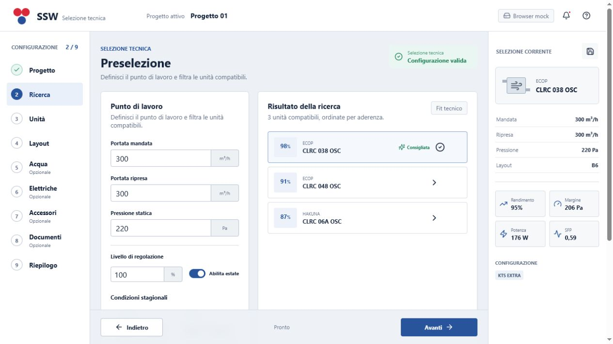

# SSW Next UI preview



## Scope

The preview is an offline WebView2 shell beside the production WinForms
interface. It demonstrates the guided workflow without changing the current
default startup path or the production version.

Implemented with real local data:

- model and series catalog from `DataCentral.sdf`;
- current balanced winter and summer calculation through
  `CLSelectionApplicationService`;
- pressure, power, efficiency, SFP and thermodynamic results;
- HEDes water-coil catalog and calculation, including the second calculation
  pass at the airflow actually available after the additional pressure loss;
- PEHD/EHD catalog, temperature calculation, compatibility rules and
  additional quadratic air-pressure loss;
- legacy layout variants, dimensions and four flow-port records through a
  UI-neutral repository;
- localized accessory catalog and model relations;
- canonical `.sswsel` document creation and serializer round-trip;
- production save/project/report workflow reached with the complete selection
  document, preserving RDLC, email and follow-up behavior;
- contextual help, optional tooltips and the 14 SSW language choices;
- local bundled frontend assets.

Intentionally delegated to the production workflow:

- the final Windows save dialogs and project editor;
- RDLC rendering, technical-selection registration, email composition and
  follow-up scheduling;
- reopening historical projects and creating alternatives.

The new host transfers a canonical `CLSelectionProjectDocument` to
`CLMainForm`; it does not copy formulas, serializers or report logic into
TypeScript. This adapter is the deliberate compatibility boundary for the
first parity prototype and can be removed in Onda 7 after parallel validation.

## Build and run

```powershell
cd D:\mdev\SSW
& 'C:\Program Files (x86)\Microsoft Visual Studio\2019\Enterprise\MSBuild\Current\Bin\MSBuild.exe' `
  .\SSW.sln /p:Configuration=AV /p:Platform=x86 /m
.\SSW\bin\x86\AV\SSW.exe --next-ui
```

The build runs the TypeScript/Vite build and copies `dist` to
`SSW\bin\x86\AV\frontend\ssw-next`.

For hot reload:

```powershell
cd D:\mdev\SSW\frontend\ssw-next
npm run dev
$env:SSW_NEXT_UI_DEV_URL = 'http://127.0.0.1:5173'
D:\mdev\SSW\SSW\bin\x86\AV\SSW.exe --next-ui
```

## Verification

`tests\Invoke-NextUiSmoke.ps1` verifies the exact AV executable, packaged
frontend, x86 WebView2 loader, model catalog, real winter/summer calculation,
layout repository, water-coil calculation and canonical project serializer
round-trip. The smoke is part of
`Invoke-TechnicalSelectionReleaseTests.ps1`.

The browser prototype has been checked at `1440x900` and `1024x768` across all
nine steps with no horizontal overflow.
